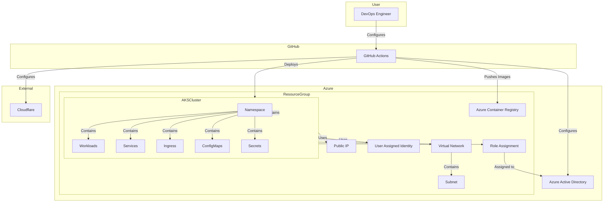

# Terraform AKS Setup <!-- omit in toc -->


This repository contains Terraform configurations for setting up an Azure Kubernetes Service (AKS) cluster with supporting infrastructure. It includes modules for Azure AD, AKS, ACR, and networking. The setup also integrates automated certificate management with cert-manager and Let's Encrypt. Helm is used for deploying applications and managing Kubernetes resources.

## Table of Contents <!-- omit in toc -->

- [About](#about)
  - [Who is this for?](#who-is-this-for)
  - [Estimated Cost](#estimated-cost)
  - [Why use Terraform?](#why-use-terraform)
  - [Why use AKS?](#why-use-aks)
  - [Why use Helm?](#why-use-helm)
- [C4 Diagram](#c4-diagram)
- [Resource Descriptions](#resource-descriptions)
- [Project Directory Structure](#project-directory-structure)
- [Prerequisites](#prerequisites)
- [Setting Up Terraform Configuration](#setting-up-terraform-configuration)
  - [Clone the Repository](#clone-the-repository)
  - [Create a `terraform.tfvars` File](#create-a-terraformtfvars-file)
  - [Getting `terraform.tfvars` Information](#getting-terraformtfvars-information)
- [Using Terraform](#using-terraform)
  - [Initialize Terraform](#initialize-terraform)
  - [Validate the Configuration](#validate-the-configuration)
  - [Plan the Deployment](#plan-the-deployment)
  - [Deploy the Resources](#deploy-the-resources)
- [Accessing the AKS Cluster](#accessing-the-aks-cluster)
  - [Fetch AKS Cluster Credentials](#fetch-aks-cluster-credentials)
  - [Verify the Cluster](#verify-the-cluster)
- [Route Traffic to the Cluster](#route-traffic-to-the-cluster)
  - [Configure DNS](#configure-dns)
- [Deploying Applications](#deploying-applications)
  - [Deploying Applications with K8s Manifests](#deploying-applications-with-k8s-manifests)
- [Optional: Store Terraform State Remotely](#optional-store-terraform-state-remotely)
  - [Create an Azure Storage Account](#create-an-azure-storage-account)
  - [Create a Storage Container](#create-a-storage-container)
  - [Configure Backend in `main.tf`](#configure-backend-in-maintf)
- [Cleaning Up](#cleaning-up)
- [Additional Resources](#additional-resources)

## About

### Who is this for?

This repository is for DevOps engineers, cloud architects, and developers who want to set up a scalable and secure AKS cluster using Terraform. It is designed for those who prefer Infrastructure as Code (IaC) for managing cloud resources. This setup is suitable home labs, enterprise environments, and development teams looking to leverage AKS for containerized applications.

### Estimated Cost

Approximately **$50 per month**. Actual costs may vary based on usage and Azure pricing.

Use Reserved Instances for cost savings.

### Why use Terraform?

Terraform is used for its declarative approach to infrastructure as code, enabling consistent and repeatable deployments. It allows for version control, collaboration, and easy management of infrastructure changes.

### Why use AKS?

AKS is a managed Kubernetes service that simplifies the deployment, management, and scaling of containerized applications. It provides built-in monitoring, security, and integration with Azure services. Cloud-native applications can benefit from AKS's scalability and flexibility.

### Why use Helm?

Helm is a package manager for Kubernetes that simplifies the deployment and management of applications on AKS. It allows for easy installation, upgrading, and rollback of applications using pre-configured charts. Helm streamlines the deployment process and enhances the overall management of Kubernetes resources.

## C4 Diagram


## Resource Descriptions

- **Azure Subscription**: The Azure billing account where all resources are created.
- **Resource Group**: A container that holds related resources for an Azure solution.
- **Virtual Network**: A logically isolated network in Azure.
- **AKS Cluster**: Azure Kubernetes Service cluster for running containerized applications.
- **ingress-nginx**: Manages external access to services in the AKS cluster.
- **webapps**: Hosts various web applications.
- **cert-manager**: Manages SSL/TLS certificates for the cluster.
- **Azure Container Registry**: A managed Docker registry service based on the open-source Docker Registry 2.0.
- **Public IP**: A static public IP address for the AKS cluster.

## Project Directory Structure

```plaintext
terraform/
├── modules/
│   ├── azure/
│   │   ├── aks/
│   │   ├── acr/
│   │   ├── entra-id/
│   │   ├── public-ip/
│   │   ├── subnet/
│   │   └── vnet/
│   ├── helm/
│   │   ├── cert-manager/
│   │   ├── cert-manager-cluster-issuer/
│   │   └── nginx-ingress-controller/
│   └── kubernetes_manifests/
│   │   └── certificate/
├── main.tf
└── README.md
```

## Prerequisites

**Azure Account**
An active Azure account with sufficient permissions to create resources.

**DNS Provider**
Cloudflare or another DNS provider for managing records to route traffic to the AKS cluster.

**Install Terraform:**
Download Terraform from the [official website](https://www.terraform.io/downloads). Verify installation:

```bash
terraform --version
```

**Install Azure CLI:**
Install Azure CLI from [Microsoft Docs](https://learn.microsoft.com/en-us/cli/azure/install-azure-cli). Log in to Azure:

```bash
az login
```

**Configure Access to Azure:**
Ensure you have sufficient permissions to create resources in Azure. Set the desired subscription:

```bash
az account set --subscription "<subscription-id>"
```

## Setting Up Terraform Configuration

### Clone the Repository

**Clone the Repository:**
Clone this repository to your local machine:

```bash
git clone https://github.com/yourusername/terraform-aks-setup.git
cd terraform-aks-setup
```

### Create a `terraform.tfvars` File

Create a `terraform.tfvars` file in the root of the repository to define the necessary variables. Reference the file `terraform.tfvars.template` for the required variables.

Example `terraform.tfvars` file:

```hcl
subscription_id       = ""
location              = ""
tenant_id             = ""
admin_user_object_id  = ""
acr_name              = ""
resource_name_prefix  = ""
email                 = ""
domain                = ""
cloudflare_api_token  = ""
cloudflare_zone_id    = ""
```

### Getting `terraform.tfvars` Information

To fill in the `terraform.tfvars` file, you will need the following information:

- `subscription_id`: Your Azure subscription ID.
- `location`: The Azure region where you want to deploy the resources (e.g., "East US").
- `tenant_id`: Your Azure Active Directory tenant ID.
- `admin_user_object_id`: The object ID of the Azure AD user or group that will have admin access to the AKS cluster.
- `acr_name`: The name of the Azure Container Registry (ACR) to be created or used.
- `resource_name_prefix`: A prefix for naming the resources to avoid name conflicts.
- `email`: Your email address for notifications.
- `domain`: The domain name for your cluster.
- `cloudflare_api_token`: The API token for your Cloudflare account.
- `cloudflare_zone_id`: The Zone ID for your Cloudflare domain.

You can find most of this information in the Azure portal or by using the Azure CLI.

## Using Terraform

### Initialize Terraform

Download necessary providers and set up the environment:

```bash
terraform init
```

### Validate the Configuration

Ensure your configuration is error-free:

```bash
terraform validate
```

### Plan the Deployment

Preview the changes Terraform will apply:

```bash
terraform plan
```

### Deploy the Resources

Apply the configuration to create the AKS cluster and related resources:

```bash
terraform apply
```

Confirm the action by typing `yes` when prompted. Go get a coffee, this will take a while. ☕️

## Accessing the AKS Cluster

### Fetch AKS Cluster Credentials

Configure `kubectl` to connect to your AKS cluster:

```bash
az aks get-credentials --resource-group <resource-group-name> --name <aks-cluster-name>
```

### Verify the Cluster

Ensure the cluster is accessible:

```bash
kubectl get nodes
```

## Route Traffic to the Cluster

### Configure DNS

Update your domain's DNS settings to point to the public IP address of the AKS cluster as an A record. You can use Cloudflare or another DNS provider for this.

## Deploying Applications

### Deploying Applications with K8s Manifests

You can deploy applications to the AKS cluster using Kubernetes manifests. Create deployment and service manifests for your applications and apply them using `kubectl`.

Example commands:

```bash
kubectl apply -f k8s/deployment.yaml
kubectl apply -f k8s/service.yaml
kubectl apply -f k8s/ingress.yaml
```

Example deployment manifest (`k8s/deployment.yaml`):

```yaml
apiVersion: apps/v1
kind: Deployment
metadata:
  name: homepage
  namespace: webapps
spec:
  replicas: 2
  selector:
    matchLabels:
      app: homepage
  template:
    metadata:
      labels:
        app: homepage
    spec:
      containers:
      - name: homepage
        image: <your-container-registry>/homepage:latest
        ports:
        - containerPort: 3000
        readinessProbe:
          httpGet:
            path: /api/health
            port: 3000
          initialDelaySeconds: 5
          periodSeconds: 10
          failureThreshold: 3
        livenessProbe:
          httpGet:
            path: /api/health
            port: 3000
          initialDelaySeconds: 15
          periodSeconds: 20
          failureThreshold: 3
```

Example service manifest (`k8s/service.yaml`):

```yaml
apiVersion: v1
kind: Service
metadata:
  name: webapp
spec:
  selector:
    app: webapp
  ports:
    - protocol: TCP
      port: 80
      targetPort: 3000
  type: LoadBalancer
```

Example ingress manifest (`k8s/ingress.yaml`):

```yaml
apiVersion: networking.k8s.io/v1
kind: Ingress
metadata:
  name: homepage-ingress
  namespace: webapps
  annotations:
    nginx.ingress.kubernetes.io/rewrite-target: /
    cert-manager.io/cluster-issuer: letsencrypt-dns
spec:
  ingressClassName: nginx
  tls:
  - hosts:
    - dev.example.com
    - example.com
    secretName: wildcard-example.com-tls
  rules:
  - host: dev.example.com
    http:
      paths:
      - path: /
        pathType: Prefix
        backend:
          service:
            name: homepage
            port:
              number: 80
  - host: example.com
    http:
      paths:
      - path: /
        pathType: Prefix
        backend:
          service:
            name: homepage
            port:
              number: 80
```

Example dockerfile for an NX Next.js app:

```dockerfile
# Use the official Node.js image as the base image
FROM node:20-alpine AS base

# Install dependencies only when needed
FROM base AS deps
# Check https://github.com/nodejs/docker-node/tree/b4117f9333da4138b03a546ec926ef50a31506c3#nodealpine to understand why libc6-compat might be needed.
RUN apk add --no-cache libc6-compat
WORKDIR /app

# Install dependencies based on the preferred package manager
COPY package.json yarn.lock* package-lock.json* pnpm-lock.yaml* .npmrc* ./
RUN \
  if [ -f yarn.lock ]; then yarn --frozen-lockfile; \
  elif [ -f package-lock.json ]; then npm ci; \
  elif [ -f pnpm-lock.yaml ]; then corepack enable pnpm && pnpm i --frozen-lockfile; \
  else echo "Lockfile not found." && exit 1; \
  fi

# Rebuild the source code only when needed
FROM base AS builder
WORKDIR /app
COPY --from=deps /app/node_modules ./node_modules
COPY . .

# Next.js collects completely anonymous telemetry data about general usage.
# Learn more here: https://nextjs.org/telemetry
# Uncomment the following line in case you want to disable telemetry during the build.
# ENV NEXT_TELEMETRY_DISABLED=1

RUN npm run build

# Production image, copy all the files and run next
FROM base AS runner
WORKDIR /app

ENV NODE_ENV=production
# Uncomment the following line in case you want to disable telemetry during runtime.
# ENV NEXT_TELEMETRY_DISABLED=1

RUN addgroup --system --gid 1001 nodejs
RUN adduser --system --uid 1001 nextjs

COPY --from=builder /app ./

USER nextjs

EXPOSE 3000

ENV PORT=3000

CMD ["npx", "next", "start"]
```

Example manual deployment:

```bash
#!/bin/bash

# Variables
ACR_NAME="YOURACR"
ACR_LOGIN_SERVER="${ACR_NAME}.azurecr.io"
IMAGE_NAME="homepage"
IMAGE_TAG="latest"
NAMESPACE="webapps"
RESOURCE_GROUP="aks-shared"
AKS_CLUSTER="aks-shared-cluster"
SKIP_BUILD=false

# Parse arguments
while [[ "$#" -gt 0 ]]; do
    case $1 in
        --skip-build|-s) SKIP_BUILD=true ;;
        *) echo "Unknown parameter passed: $1"; exit 1 ;;
    esac
    shift
done

# Login to Azure Container Registry
echo "Logging in to Azure Container Registry..."
az acr login --name $ACR_NAME

if [ "$SKIP_BUILD" = false ]; then
    # Create a new builder instance
    docker buildx create --use

    # Pull the latest image to use as cache
    docker pull ${ACR_LOGIN_SERVER}/${IMAGE_NAME}:${IMAGE_TAG} || true

    # Build and push the multi-platform Docker image with cache
    echo "Building and pushing the multi-platform Docker image..."
    docker buildx build --platform linux/amd64,linux/arm64 \
        --cache-from=type=registry,ref=${ACR_LOGIN_SERVER}/${IMAGE_NAME}:${IMAGE_TAG} \
        --cache-to=type=inline \
        -t ${ACR_LOGIN_SERVER}/${IMAGE_NAME}:${IMAGE_TAG} --push .
else
    echo "Skipping Docker build and push..."
fi

# Check the effective outbound IPs for the AKS cluster
az aks show --resource-group $RESOURCE_GROUP --name $AKS_CLUSTER --query "networkProfile.loadBalancerProfile.effectiveOutboundIPs"

# List all public IP addresses in the resource group
az network public-ip list --resource-group $RESOURCE_GROUP --output table

# List all load balancers in the resource group
az network lb list --resource-group $RESOURCE_GROUP --output table

# Get AKS credentials
echo "Fetching AKS credentials..."
az aks get-credentials --resource-group $RESOURCE_GROUP --name $AKS_CLUSTER --overwrite-existing

# Apply the Kubernetes deployment file
echo "Applying the Kubernetes deployment file..."
kubectl apply -f k8s/deployment.yaml --namespace=${NAMESPACE}
kubectl apply -f k8s/service.yaml --namespace=${NAMESPACE}
kubectl apply -f k8s/ingress.yaml --namespace=${NAMESPACE}

# Check the status of the deployment
echo "Checking the status of the deployment..."
kubectl get pods --namespace=${NAMESPACE}
kubectl get services --namespace=${NAMESPACE}
kubectl get ingress --namespace=${NAMESPACE}

echo "==Deployment script finished=="
```

## Optional: Store Terraform State Remotely

### Create an Azure Storage Account

```bash
az storage account create --name <storage-account-name> --resource-group <resource-group-name> --location "East US" --sku Standard_LRS
```

### Create a Storage Container

```bash
az storage container create --name tfstate --account-name <storage-account-name>
```

### Configure Backend in `main.tf`

Update your `main.tf` file to include the backend configuration:

```hcl
terraform {
  backend "azurerm" {
    resource_group_name   = "<resource-group-name>"
    storage_account_name  = "<storage-account-name>"
    container_name        = "tfstate"
    key                   = "terraform.tfstate"
  }
}
```

## Cleaning Up

To clean up the resources created by Terraform, run:

```bash
terraform destroy
```

Confirm the action by typing `yes` when prompted.

## Additional Resources

- [Terraform Documentation](https://www.terraform.io/docs/index.html)
- [Azure Provider for Terraform](https://registry.terraform.io/providers/hashicorp/azurerm/latest/docs)
- [AKS Documentation](https://learn.microsoft.com/en-us/azure/aks/)
- [Helm Documentation](https://helm.sh/docs/)
- [cert-manager Documentation](https://cert-manager.io/docs/)
- [Let's Encrypt Documentation](https://letsencrypt.org/docs/)
- [Cloudflare API Documentation](https://api.cloudflare.com/)
- [Azure CLI Documentation](https://learn.microsoft.com/en-us/cli/azure/)
